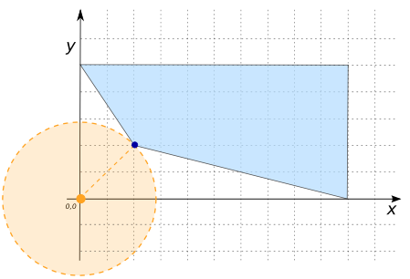
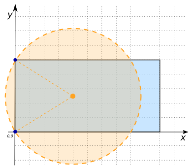
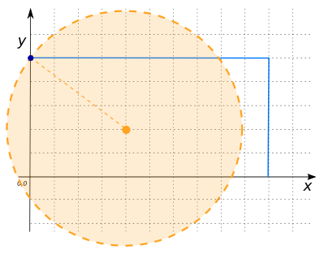

# ST_ClosestCoordinate

## Signatures

```sql
{POINT, MULTIPOINT} ST_ClosestCoordinate(POINT point, GEOMETRY geom);
```

## Description

Returns the coordinate of `geom` closest to `point` using 2D distances
(z-coordinates are ignored).



## Examples

```sql
SELECT ST_ClosestCoordinate('POINT(0 0)',
                            'POLYGON((2 2, 10 0, 10 5, 0 5, 2 2))');
-- Answer: POINT(2 2)
```

{align=center}

```sql
SELECT ST_ClosestCoordinate('POINT(4 2.5)',
                            'POLYGON((0 0, 10 0, 10 5, 0 5, 0 0))');
-- Answer: MULTIPOINT((0 0), (0 5))
```

{align=center}

```sql
SELECT ST_ClosestCoordinate('POINT(4 2)',
                            'LINESTRING(10 0, 10 5, 0 5)');
-- Answer: POINT(0 5)
```

{align=center}

```sql
CREATE TABLE input_table(point POINT);
INSERT INTO input_table VALUES
    ('POINT(0 0)'),
    ('POINT(4 2.5)'),
    ('POINT(5 2.5)'),
    ('POINT(6 2.5)'),
    ('POINT(5 7)');
SELECT ST_ClosestCoordinate(point,
    'POLYGON((0 0, 10 0, 10 5, 0 5, 0 0))') CLCOORD FROM input_table;
-- Answer:
--    |                 CLCOORD                   |
--    |-------------------------------------------|
--    | POINT(0 0)                                |
--    | MULTIPOINT((0 0), (0 5))                  |
--    | MULTIPOINT((0 0), (10 0), (10 5), (0 5))  |
--    | MULTIPOINT((10 0), (10 5))                |
--    | MULTIPOINT((0 5), (10 5))                 |
```

## See also

* [`ST_ClosestPoint`](../ST_ClosestPoint), [`ST_FurthestCoordinate`](../ST_FurthestCoordinate)
* <a href="https://github.com/orbisgis/h2gis/blob/master/h2gis-functions/src/main/java/org/h2gis/functions/spatial/distance/ST_ClosestCoordinate.java" target="_blank">Source code</a>
