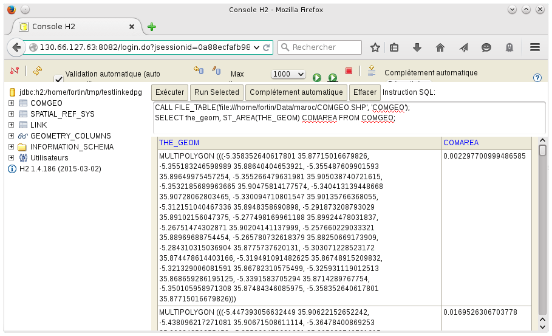

# Quick-start guide

Download the latest H2GIS web interface on the home page ([here](https://github.com/orbisgis/h2gis/releases)), unzip it and finally run the jar called h2-dist. Then click on **Connect** in the web interface. You will of course need a working [Java](http://java.com/en/download/index.jsp) runtime environment.

Command-line gurus can just execute the following commands *(example with v2.2.3)*:

```console
~ $ wget https://github.com/orbisgis/h2gis/releases/download/v2.2.3/h2gis-standalone-bin.zip -O h2gis.zip
~ $ unzip h2gis.zip
~ $ cd h2gis-standalone
~/h2gis-standalone $ java -jar h2gis-dist-2.2.3.jar
```

## Initialize the H2GIS extension

Once connected to the H2GIS database, to load the spatial functions, the user must execute the following SQL instructions:

```sql
CREATE ALIAS IF NOT EXISTS H2GIS_SPATIAL FOR "org.h2gis.functions.factory.H2GISFunctions.load";
CALL H2GIS_SPATIAL();
```

To open a shape file and show its contents:

```sql
CALL FILE_TABLE('/home/user/myshapefile.shp', 'tablename');
SELECT * FROM TABLENAME;
```

## Web interface

This is the built-in web interface of the H2 Database:

{align=center}

## Graphical user interface

Software GUI that embed H2GIS:

* [DBeaver](https://dbeaver.io/)


